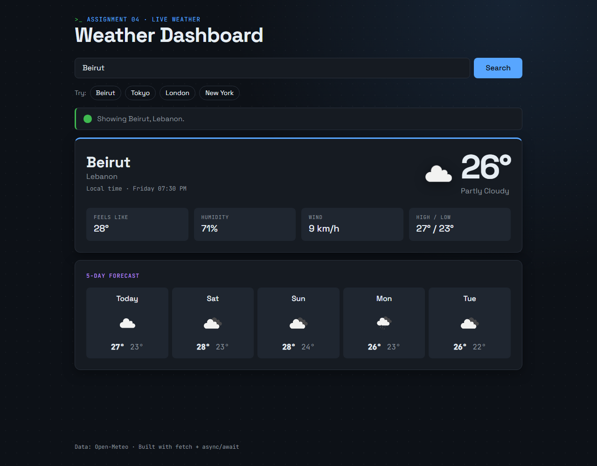
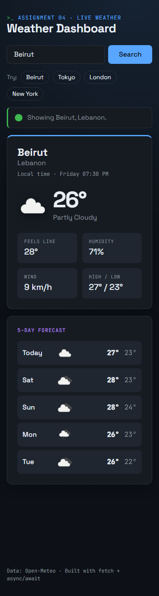

# Weather Dashboard — Assignment 4

Type a city and get live weather: current temperature, conditions, an icon, feels-like, humidity, wind, today's high/low and a 5-day forecast. The app handles real-world network conditions: slow, failed, or just wrong.





## Features

- **Search** by city name (press Enter or click Search), plus quick-pick buttons
- **Live data** from **OpenWeatherMap** (with an API key) or **Open-Meteo** (automatic fallback, no key needed)
- **Current weather:** temperature, description, weather icon, feels like, humidity, wind speed, high/low, and the city's local time
- **5-day forecast** row
- **Four UI states:** idle → loading → success / error
  - Loading: spinner, message, and the Search button is disabled so it can't be double-submitted
  - Error: a plain-language message, with a **Retry** button when retrying could help
- **Responsive:** mobile-first layout using CSS Grid and Flexbox; works from 320px phones to desktop
- Remembers the last city you searched, and opens a city straight from the URL: `index.html?city=Tokyo`

## Setup

### 1. Get the code

```bash
git clone https://github.com/Harb250/weather-dashboard.git
cd weather-dashboard
```

### 2. Get an API key (OpenWeatherMap, free)

1. Create a free account at <https://home.openweathermap.org/users/sign_up>.
2. Open **My API keys**: <https://home.openweathermap.org/api_keys>.
3. Copy the default key, or generate a new one.

> ⏳ New keys can take **up to 2 hours** to activate. Until then, OpenWeatherMap returns `401`, and the app shows "The API key was rejected".

### 3. Add the key to the project (without committing it)

```bash
cp js/config.example.js js/config.js
```

Open `js/config.js` and paste your key:

```js
export const OPENWEATHER_API_KEY = 'your-key-here';
```

`js/config.js` is listed in `.gitignore`, so the key never reaches GitHub. Only the empty placeholder `js/config.example.js` is committed.

> **Why `config.js` and not `.env`?** This is a plain HTML/CSS/JS site with no build tool. Browsers can't read `.env` files, so a git-ignored config script does the same job. (`.env` is in `.gitignore` too, just in case.)

> **No key?** Leave the key empty, or skip step 3. The app automatically uses [Open-Meteo](https://open-meteo.com/), which is free and needs no key, so it always runs. The footer shows which API supplied the data.

### 4. Run it

**Double-click `index.html`.** That's it: no build step and no server needed.

A local server works too, if you prefer one: VS Code **Live Server**, `npx serve .`, or `python -m http.server 8000`.

> If you skipped step 3, the browser's Network tab shows a `404` for `js/config.js`. That is expected: the file is optional, and the app falls back to Open-Meteo.

## Project structure

```
weather-dashboard/
├── index.html                 # markup: search form, status area, result cards
├── css/
│   └── styles.css             # design tokens (CSS variables), components, breakpoints
├── js/
│   ├── main.js                # events, UI state (idle/loading/success/error), picks the provider (loaded last)
│   ├── api.js                 # getJSON(): fetch + timeout + response.ok check → ApiError
│   ├── render.js              # renderWeather(): data in, DOM out (textContent only)
│   ├── config.example.js      # documented placeholder for the API key (committed)
│   ├── config.js              # your real key (git-ignored, you create it)
│   └── providers/
│       ├── openweathermap.js  # OpenWeatherMap → normalized data
│       └── openmeteo.js       # Open-Meteo geocoding + forecast → normalized data
├── screenshots/
└── .gitignore
```

The scripts are plain `<script defer>` files loaded in order (no ES modules), so the page also runs from `file://`. Each file wraps its code in a function and exposes only what other files need (`getJSON`, `OpenMeteo`, `OpenWeatherMap`, `renderWeather`).

Both providers return the **same normalized object** (`place`, `current`, `daily`). `render.js` and `main.js` never need to know which API was used.

## How errors are handled

All network calls go through `getJSON()` in `js/api.js`, using `async`/`await` inside `try`/`catch`:

1. `fetch()` rejects when the network fails (offline, DNS, CORS), or when the 10-second timeout aborts it.
2. A `404` or `500` doesn't make `fetch()` reject, so the code checks `response.ok` and **throws** for any non-2xx status.
3. Invalid JSON is also caught.

Every failure becomes an `ApiError` with a `kind`. `main.js` catches it and shows a friendly message, so nothing reaches the console unhandled.

| Situation | What the user sees | Retry button |
|---|---|---|
| Empty search | "Type a city name first…" | — |
| City not found (`404` / no geocoding results) | "We couldn't find a city called …" | — |
| Offline / DNS / CORS | "Couldn't reach the weather service…" | ✓ |
| Slow server (> 10 s) | "…taking too long to answer." | ✓ |
| Rate limited (`429`) | "Too many requests right now…" | ✓ |
| Bad API key (`401`) | "The API key was rejected…" | — |
| Server error (`5xx`) | "…having problems (HTTP 500)…" | ✓ |

**Try it:** open DevTools → **Network**, set throttling to **Offline** (or **Slow 3G**), and search.

## Tech

HTML5, CSS3 (custom properties, Grid, Flexbox, media queries), and vanilla JavaScript (`async`/`await`, Fetch API, `URLSearchParams`, `AbortSignal.timeout`, `Intl`). No frameworks or build step.

## Credits

- Weather data: [OpenWeatherMap](https://openweathermap.org/) and [Open-Meteo](https://open-meteo.com/)
- Weather icons: OpenWeatherMap icon set
